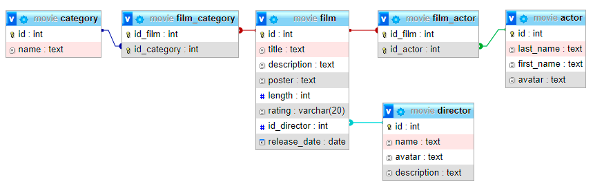

# Database movie

## Tạo database movie

```sql
CREATE DATABASE movie
```

## Tạo table director

```sql
CREATE TABLE director(
    id INT PRIMARY KEY AUTO_INCREMENT,
    name TEXT NOT NULL,
    avatar TEXT,
    description TEXT
)
```

## Tạo table actor

```sql
CREATE TABLE actor(
    id INT PRIMARY KEY AUTO_INCREMENT,
    last_name TEXT NOT NULL,
    first_name TEXT NOT NULL,
    avatar TEXT 
)
```

## Tạo table film

```sql
CREATE TABLE film(
    id INT PRIMARY KEY AUTO_INCREMENT,
    title TEXT NOT NULL,
    description TEXT,
    poster TEXT,
    length INT NOT NULL,
    rating VARCHAR(20),
    id_director INT,
    release_date DATE NOT NULL,
    FOREIGN KEY(id_director) REFERENCES director(id)
)
```

## Tạo table category

```sql
CREATE TABLE category(
    id INT PRIMARY KEY AUTO_INCREMENT,
    name TEXT NOT NULL
)
```

## Tạo table film_actor

```sql
CREATE TABLE film_actor(
    id_film INT,
    id_actor INT,
    PRIMARY KEY(id_film, id_actor),
    FOREIGN KEY(id_film) REFERENCES film(id),
    FOREIGN KEY(id_actor) REFERENCES actor(id)
)
```

## Tạo table film_category

```sql
CREATE TABLE film_category(
    id_film INT,
    id_category INT,
    PRIMARY KEY(id_film, id_category),
    FOREIGN KEY(id_film) REFERENCES film(id),
    FOREIGN KEY(id_category) REFERENCES category(id)
)
```

## Bộ thiết kế


## Markdown


