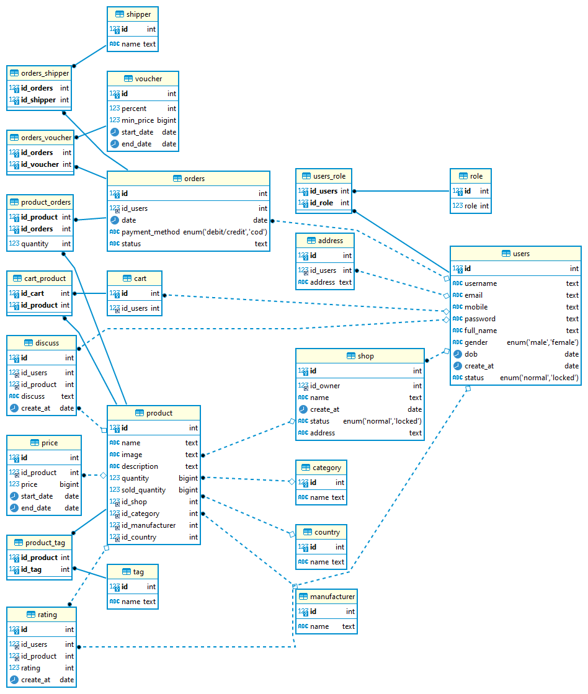

# Cơ sở dữ liệu cho nền tảng thương mại điện tử

## Thiết kế sơ bộ


## Thiết kế cơ bản


## Xuất diagram từ DBeaver



## Bảng `address` - địa chỉ

```sql
CREATE TABLE `address` (
  `id` int NOT NULL AUTO_INCREMENT,
  `id_users` int NOT NULL,
  `address` text NOT NULL,
  PRIMARY KEY (`id`),
  KEY `id_users` (`id_users`),
  CONSTRAINT `address_ibfk_1` FOREIGN KEY (`id_users`) REFERENCES `users` (`id`) ON DELETE CASCADE
)
```


## Bảng `cart`- giỏ hàng

```sql
CREATE TABLE `cart` (
  `id` int NOT NULL AUTO_INCREMENT,
  `id_users` int NOT NULL,
  PRIMARY KEY (`id`),
  KEY `id_users` (`id_users`),
  CONSTRAINT `cart_ibfk_1` FOREIGN KEY (`id_users`) REFERENCES `users` (`id`) ON DELETE CASCADE
)
```


## Bảng `cart_product`

```sql
CREATE TABLE `cart_product` (
  `id_cart` int NOT NULL,
  `id_product` int NOT NULL,
  PRIMARY KEY (`id_cart`,`id_product`),
  KEY `id_product` (`id_product`),
  CONSTRAINT `cart_product_ibfk_1` FOREIGN KEY (`id_cart`) REFERENCES `cart` (`id`) ON DELETE CASCADE,
  CONSTRAINT `cart_product_ibfk_2` FOREIGN KEY (`id_product`) REFERENCES `product` (`id`)
)
```


## Bảng `category` - danh mục sản phẩm

```sql
CREATE TABLE `category` (
  `id` int NOT NULL AUTO_INCREMENT,
  `name` text NOT NULL,
  PRIMARY KEY (`id`)
)
```


## Bảng `country` - quốc gia

```sql
CREATE TABLE `country` (
  `id` int NOT NULL AUTO_INCREMENT,
  `name` text NOT NULL,
  PRIMARY KEY (`id`)
)
```


## Bảng `discuss` - thảo luận

```sql
CREATE TABLE `discuss` (
  `id` int NOT NULL AUTO_INCREMENT,
  `id_users` int NOT NULL,
  `id_product` int NOT NULL,
  `discuss` text NOT NULL,
  `create_at` date NOT NULL,
  PRIMARY KEY (`id`),
  KEY `id_users` (`id_users`),
  KEY `id_product` (`id_product`),
  CONSTRAINT `discuss_ibfk_1` FOREIGN KEY (`id_users`) REFERENCES `users` (`id`),
  CONSTRAINT `discuss_ibfk_2` FOREIGN KEY (`id_product`) REFERENCES `product` (`id`) ON DELETE CASCADE
)
```


## Bảng `manufacturer` - nhà sản xuất

```sql
CREATE TABLE `manufacturer` (
  `id` int NOT NULL AUTO_INCREMENT,
  `name` text NOT NULL,
  PRIMARY KEY (`id`)
)
```


## Bảng `orders` - đơn hàng

```sql
CREATE TABLE `orders` (
  `id` int NOT NULL AUTO_INCREMENT,
  `id_users` int NOT NULL,
  `date` date DEFAULT NULL,
  `payment_method` enum('debit/credit','cod') NOT NULL,
  `status` text,
  PRIMARY KEY (`id`),
  KEY `id_users` (`id_users`),
  CONSTRAINT `orders_ibfk_1` FOREIGN KEY (`id_users`) REFERENCES `users` (`id`)
)
```


## Bảng `orders_shipper`

```sql
CREATE TABLE `orders_shipper` (
  `id_orders` int NOT NULL,
  `id_shipper` int NOT NULL,
  PRIMARY KEY (`id_orders`,`id_shipper`),
  KEY `id_shipper` (`id_shipper`),
  CONSTRAINT `orders_shipper_ibfk_1` FOREIGN KEY (`id_orders`) REFERENCES `orders` (`id`) ON DELETE CASCADE,
  CONSTRAINT `orders_shipper_ibfk_2` FOREIGN KEY (`id_shipper`) REFERENCES `shipper` (`id`)
)
```


## Bảng `orders_voucher`

```sql
CREATE TABLE `orders_voucher` (
  `id_orders` int NOT NULL,
  `id_voucher` int NOT NULL,
  PRIMARY KEY (`id_orders`,`id_voucher`),
  KEY `id_voucher` (`id_voucher`),
  CONSTRAINT `orders_voucher_ibfk_1` FOREIGN KEY (`id_orders`) REFERENCES `orders` (`id`) ON DELETE CASCADE,
  CONSTRAINT `orders_voucher_ibfk_2` FOREIGN KEY (`id_voucher`) REFERENCES `voucher` (`id`)
)
```


## Bảng `price` - giá

```sql
CREATE TABLE `price` (
  `id` int NOT NULL AUTO_INCREMENT,
  `id_product` int DEFAULT NULL,
  `price` bigint NOT NULL,
  `start_date` date NOT NULL,
  `end_date` date DEFAULT NULL,
  PRIMARY KEY (`id`),
  KEY `id_product` (`id_product`),
  CONSTRAINT `price_ibfk_1` FOREIGN KEY (`id_product`) REFERENCES `product` (`id`) ON DELETE CASCADE
)
```


## Bảng `product` - sản phẩm

```sql
CREATE TABLE `product` (
  `id` int NOT NULL AUTO_INCREMENT,
  `name` text CHARACTER SET utf8mb4 COLLATE utf8mb4_0900_ai_ci NOT NULL,
  `image` text,
  `description` text NOT NULL,
  `quantity` bigint DEFAULT NULL,
  `sold_quantity` bigint NOT NULL,
  `id_shop` int NOT NULL,
  `id_category` int NOT NULL,
  `id_manufacturer` int NOT NULL,
  `id_country` int NOT NULL,
  PRIMARY KEY (`id`),
  KEY `id_shop` (`id_shop`),
  KEY `id_category` (`id_category`),
  KEY `id_manufacturer` (`id_manufacturer`),
  KEY `id_country` (`id_country`),
  CONSTRAINT `product_ibfk_1` FOREIGN KEY (`id_shop`) REFERENCES `shop` (`id`),
  CONSTRAINT `product_ibfk_2` FOREIGN KEY (`id_category`) REFERENCES `category` (`id`),
  CONSTRAINT `product_ibfk_3` FOREIGN KEY (`id_manufacturer`) REFERENCES `manufacturer` (`id`),
  CONSTRAINT `product_ibfk_4` FOREIGN KEY (`id_country`) REFERENCES `country` (`id`)
)
```


## Bảng `product_orders`

```sql
CREATE TABLE `product_orders` (
  `id_product` int NOT NULL,
  `id_orders` int NOT NULL,
  `quantity` int NOT NULL,
  PRIMARY KEY (`id_product`,`id_orders`),
  KEY `id_orders` (`id_orders`),
  CONSTRAINT `product_orders_ibfk_1` FOREIGN KEY (`id_product`) REFERENCES `product` (`id`),
  CONSTRAINT `product_orders_ibfk_2` FOREIGN KEY (`id_orders`) REFERENCES `orders` (`id`)
)
```


## Bảng `product_tag`

```sql
CREATE TABLE `product_tag` (
  `id_product` int NOT NULL,
  `id_tag` int NOT NULL,
  PRIMARY KEY (`id_product`,`id_tag`),
  KEY `id_tag` (`id_tag`),
  CONSTRAINT `product_tag_ibfk_1` FOREIGN KEY (`id_product`) REFERENCES `product` (`id`) ON DELETE CASCADE,
  CONSTRAINT `product_tag_ibfk_2` FOREIGN KEY (`id_tag`) REFERENCES `tag` (`id`) ON DELETE CASCADE
)
```


## Bảng `rating` - đánh giá

```sql
CREATE TABLE `rating` (
  `id` int NOT NULL AUTO_INCREMENT,
  `id_users` int NOT NULL,
  `id_product` int NOT NULL,
  `rating` int NOT NULL,
  `create_at` date NOT NULL,
  PRIMARY KEY (`id`),
  KEY `id_users` (`id_users`),
  KEY `id_product` (`id_product`),
  CONSTRAINT `rating_ibfk_1` FOREIGN KEY (`id_users`) REFERENCES `users` (`id`),
  CONSTRAINT `rating_ibfk_2` FOREIGN KEY (`id_product`) REFERENCES `product` (`id`) ON DELETE CASCADE
)
```


## Bảng `role` - vai trò

```sql
CREATE TABLE `role` (
  `id` int NOT NULL AUTO_INCREMENT,
  `role` int NOT NULL,
  PRIMARY KEY (`id`)
)
```


## Bảng `shipper` - đơn vị vận chuyển

```sql
CREATE TABLE `shipper` (
  `id` int NOT NULL AUTO_INCREMENT,
  `name` text NOT NULL,
  PRIMARY KEY (`id`)
)
```


## Bảng `shop` - cửa hàng

```sql
CREATE TABLE `shop` (
  `id` int NOT NULL AUTO_INCREMENT,
  `id_owner` int NOT NULL,
  `name` text CHARACTER SET utf8mb4 COLLATE utf8mb4_0900_ai_ci NOT NULL,
  `create_at` date DEFAULT NULL,
  `status` enum('normal','locked') CHARACTER SET utf8mb4 COLLATE utf8mb4_0900_ai_ci NOT NULL,
  `address` text NOT NULL,
  PRIMARY KEY (`id`),
  KEY `id_owner` (`id_owner`),
  CONSTRAINT `shop_ibfk_1` FOREIGN KEY (`id_owner`) REFERENCES `users` (`id`)
)
```


## Bảng `tag` - thẻ

```sql
CREATE TABLE `tag` (
  `id` int NOT NULL AUTO_INCREMENT,
  `name` text NOT NULL,
  PRIMARY KEY (`id`)
)
```


## Bảng `users` - người dùng

```sql
CREATE TABLE `users` (
  `id` int NOT NULL AUTO_INCREMENT,
  `username` text NOT NULL,
  `email` text,
  `mobile` text,
  `password` text NOT NULL,
  `full_name` text NOT NULL,
  `gender` enum('male','female') DEFAULT NULL,
  `dob` date DEFAULT NULL,
  `create_at` date DEFAULT NULL,
  `status` enum('normal','locked') CHARACTER SET utf8mb4 COLLATE utf8mb4_0900_ai_ci NOT NULL,
  PRIMARY KEY (`id`)
)
```


## Bảng `users_role`

```sql
CREATE TABLE `users_role` (
  `id_users` int NOT NULL,
  `id_role` int NOT NULL,
  PRIMARY KEY (`id_users`,`id_role`),
  KEY `id_role` (`id_role`),
  CONSTRAINT `users_role_ibfk_1` FOREIGN KEY (`id_users`) REFERENCES `users` (`id`) ON DELETE CASCADE,
  CONSTRAINT `users_role_ibfk_2` FOREIGN KEY (`id_role`) REFERENCES `role` (`id`) ON DELETE CASCADE
)
```


## Bảng `voucher` - mã giảm giá

```sql
CREATE TABLE `voucher` (
  `id` int NOT NULL AUTO_INCREMENT,
  `percent` int NOT NULL,
  `min_price` bigint DEFAULT NULL,
  `start_date` date NOT NULL,
  `end_date` date DEFAULT NULL,
  PRIMARY KEY (`id`)
)
```


